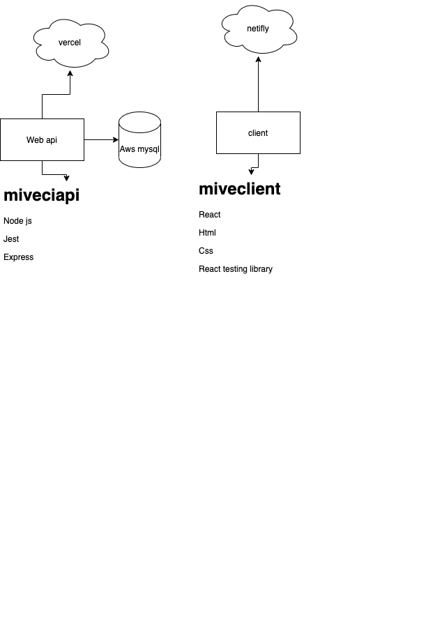

# miveci - Red social - prueba técnica

Prueba para validar los conocimientos fullstack (cliente, server, database)

Con los siguientes feautures:

*Crear usuario
*Login
*Listar usuarios
*Actualizar usuario
*Crear un post
*Dar like al post
*Crear post

Objetivos

* [x] Diagrama del full stack
   
* [x] Diagrama de base de datos
* [x] Diseño del api
* [x] Documentaciòn del api
* [x] Diseño responsive del feed
* [x] HU001 Layout
* [x] HU002 Lista de post
* [] Publicaciòn de post
* [] Publicar comentario
* [] Ver detalles de un post

## Backend
* [x] crear backend con node js and express, pruebas unitarias 
    * https://github.com/camiloamora/miveciapi
* [] documentación Api
    * https://miveciapi.vercel.app/apidoc/
* [x] Base de datos mysql
* [x] Deploy en vercel

## Cliente
* [x] crear client con react 
      * https://github.com/camiloamora/miveciclient
* [] Integrar pruebas unitarias
* [x] Integrar hooks
* [] Integrar redux
* [x] Diseño responsive feed
* [x] Deploy en netifly
    * https://laughing-dubinsky-2a7353.netlify.app/
